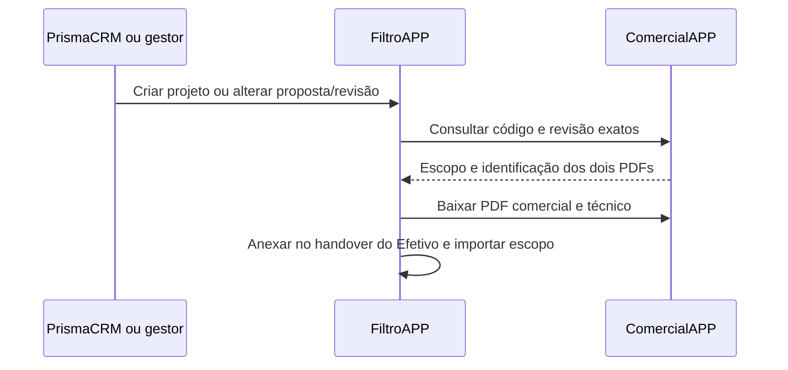

# Integração entre FiltroAPP e ComercialAPP

## Busca de documentos e escopo iniciada pelo FiltroAPP

Quando o PrismaCRM cria um projeto ou informa uma revisão superior da mesma
proposta, o FiltroAPP agenda uma busca persistida no ComercialAPP. O mesmo
acontece no cadastro manual do projeto, na alteração do vínculo da proposta e
na escolha manual de uma revisão do orçamento (Access ou ComercialAPP).
Salvar outros campos ou repetir um evento não refaz uma importação concluída
nem desfaz uma revisão escolhida manualmente.

Configure a origem HTTPS do ComercialAPP em `COMERCIALAPP_API_URL` no
ambiente do FiltroAPP, sem caminho `/api`. Reutilize o segredo já compartilhado:
`COMERCIALAPP_SERVICE_TOKEN` no FiltroAPP e `FILTROAPP_API_TOKEN` no ComercialAPP.
Essas rotas usam o token de serviço do ambiente; não exigem token de usuário
nem permissões da Central de API.

O ComercialAPP oferece:

- `GET /api/integrations/filtroapp/propostas/:code/revisoes/:revision`:
  contrato versão 1 com escopo, levantamento da finalização e metadados dos PDFs.
- `GET /api/integrations/filtroapp/propostas/:code/revisoes/:revision/documentos/:documentId`:
  download autenticado do PDF daquela proposta/revisão.

A proposta precisa estar finalizada e ter os PDFs comercial e técnico da mesma
geração, correspondentes ao conteúdo atual. A consulta independe da aprovação
no CRM. O FiltroAPP verifica código, revisão, CNPJ, vínculo do projeto quando
informado, tamanho e SHA-256 dos arquivos. Não busca uma revisão diferente
quando a solicitada estiver ausente. Cada PDF aceita até 10 MB, também sujeito
ao limite de documentos configurado no FiltroAPP.

Os arquivos ficam no armazenamento local do FiltroAPP, com versões imutáveis
e acesso pelas permissões existentes do projeto. Aparecem em **Efetivo →
Handover Comercial**, nos campos de proposta comercial e técnica, com código
e revisão visíveis. Uma revisão nova mantém os PDFs anteriores no histórico;
voltar a uma revisão já importada reutiliza suas versões. Os anexos da
integração são somente leitura. A busca não confirma aceite comercial,
não movimenta etapas e não troca a origem do orçamento.

O escopo usa a mesma projeção estruturada descrita abaixo. Edições manuais são
preservadas; serviços sem unidades ou quantidades seguras ficam como pendências
na origem do escopo. Sem levantamento estruturado, os PDFs continuam disponíveis
e o escopo exige conferência manual.

O worker consulta a fila a cada minuto, em lotes de dois projetos, com trava
compartilhada entre processos. Falhas e documentos ainda indisponíveis geram
retentativas persistidas de um minuto até uma hora. Uma alteração de revisão
substitui a solicitação anterior; respostas antigas são descartadas. Projetos
inativos, excluídos ou encerrados não são importados. A interface informa quando
os documentos da revisão ainda estão sendo aguardados.

Para implantar, publique primeiro as rotas do ComercialAPP; aplique a migração
`20261007190000_commercialapp_proposal_pull` no FiltroAPP e atualize API, worker
e frontend. A fila permanece desabilitada enquanto a origem ou o token estiverem
vazios. Projetos anteriores não são importados em massa: o reenvio idêntico do
Prisma ou uma seleção/edição do vínculo inicializa a busca quando ela não existe.

O teste `backend/test/commercial-proposal-pull.integration.test.js` usa os dois
apps e bancos PostgreSQL isolados. Exige `DATABASE_URL=TEST_DATABASE_URL` com
banco `filtroapp_bridge_test`, `COMMERCIALAPP_TEST_DATABASE_URL` com banco
`comercialapp_test` e `COMMERCIALAPP_SOURCE_DIR` apontando para o checkout do
ComercialAPP. Valida revisão nova e manual, histórico, idempotência, retentativa,
resposta superada e rollback de banco/arquivos.

## Receptor de propostas aprovadas no Acompanhamento

Esta branch adiciona uma entrada de serviço isolada do importador Access.
Configure `COMERCIALAPP_SERVICE_TOKEN` no `backend/.env` do FiltroAPP e use o
mesmo valor como `FILTROAPP_API_TOKEN` no ComercialAPP. Implante a migração
`20260929233000_comercialapp_bridge` antes de habilitar a entrega.

`POST /api/acompanhamento/comercial/comercialapp/propostas` exige Bearer token e
o contrato JSON versão 1 documentado em `comercialAPP/docs/INTEGRACOES.md`.
O receptor valida o projeto, grava proposta/revisão e evento de entrega com
identificadores únicos. Repetir um evento idêntico não duplica o orçamento.
`GET /api/acompanhamento/comercial/comercialapp/projetos?busca=...` usa o mesmo
token e permite ao gestor do Comercial localizar projetos ativos para o fallback
manual.

Uma primeira revisão aprovada preenche um orçamento vazio e aparece no
dashboard. Revisões posteriores ficam em staging; consulte por
`GET /api/acompanhamento/comercial/projetos/:projectId/comercialapp/revisoes`
e selecione com `POST .../comercialapp/selecionar`, corpo
`{"externalId":"id-da-proposta-no-comercialapp"}`. Esses dois endpoints usam a
autenticação normal do FiltroAPP; a seleção exige gestor do Acompanhamento.
Quando já existe orçamento de origem Access, a revisão nova fica em staging e
a seleção automática não o substitui. O gestor pode escolher a revisão na tela
do projeto; a interface pede confirmação da troca de origem antes de atualizar
o orçamento.

## Origem dos dados do projeto e da proposta

O Prisma CRM cria no FiltroAPP o projeto e seu vínculo comercial: código e nome
do projeto, cliente/CNPJ, código e revisão da proposta e local. Essa chamada
não envia horas ou custos. Depois da aprovação, o ComercialAPP envia a proposta
diretamente ao endpoint acima, usando o ID do projeto informado pelo CRM.

O envio do ComercialAPP inclui preço de venda, custo total e margem do
levantamento vinculado, os itens estruturados do escopo da proposta e o payload
integral desse levantamento. Inclui
também `estimateSummary` quando há levantamento: horas normais, extras e totais;
fases e carga de trabalho; custos calculados por categoria, incluindo bônus de
indicação. O custo previsto é o custo direto. Filtros e efluente já estão
incluídos nos insumos; tributos, comissões, despesas comerciais e overhead são
valores de precificação separados. Sem levantamento,
`estimateSummary` é `null` e o custo total não é informado. A versão 1 anterior
do contrato, sem esse campo, continua aceita.

O FiltroAPP usa as horas somente da revisão do ComercialAPP selecionada no
orçamento. Uma revisão em staging não altera a previsão. Horas manuais
divergentes continuam exigindo conferência no cronograma. O dashboard expõe as
categorias do levantamento separadas dos componentes históricos do Access;
campos sem equivalência segura, como dias trabalhados por projeto, não são
inferidos de fases que podem ocorrer em paralelo.

## Escopo previsto no cronograma

Ao selecionar uma revisão do ComercialAPP, o FiltroAPP lê os circuitos,
itens dimensionados e vínculos de serviço do `costBreakdown` e cadastra o
escopo previsto se o projeto ainda não tem serviços manuais. Uma nova revisão
atualiza somente o escopo que a integração havia criado; qualquer edição
manual, inclusive a exclusão de todas as linhas, preserva a decisão humana.
Uma alteração somente das horas não altera a origem do escopo.
Reenvios da proposta só sincronizam quando ela continua sendo a revisão vigente
do orçamento no FiltroAPP.
O gestor pode acionar **Sincronizar escopo** na revisão atual para importar
propostas recebidas antes desta funcionalidade.

Tubulações usam quantidade × comprimento em metros. A bitola informada em
polegadas no ComercialAPP é gravada em milímetros para o cálculo de volume e
volta a polegadas no cronograma (por exemplo, 50,8 mm → 2 pol). Volumes de
óleo usam litros, sem multiplicar pelos ciclos do circuito. Limpeza química,
teste hidrostático, flushing e filtragem entram nas categorias acompanhadas
pelo RDO; serviços sem categoria ou unidade segura aparecem como pendências
para conferência no editor do cronograma. Flushing primário e secundário no
mesmo item compõem uma única medição de flushing. Os pesos iniciais das
categorias são distribuídos igualmente e podem ser editados pelo gestor.

Publique este receptor antes do emissor do ComercialAPP. Entregas antigas sem
`estimateSummary` continuam válidas; propostas já concluídas no ComercialAPP
precisam de uma rotina específica de atualização para receber o novo campo.
