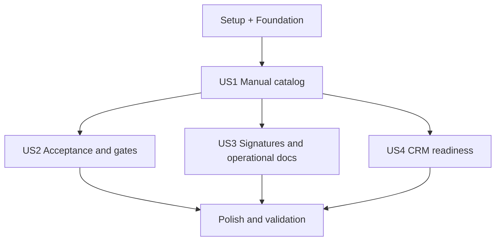

# Tasks: Documentos do projeto

**Input**: Design documents from `/specs/028-project-documents/`

**Prerequisites**: plan.md, spec.md, research.md, data-model.md, contracts/, quickstart.md

**Tests**: Regras e rotas de backend terão cobertura conforme a constitution; contratos visuais e de navegação terão testes no frontend.

**Organization**: Tasks are grouped by user story so each increment remains demonstrable and independently testable.

## Format: `[ID] [P?] [Story] Description`

- **[P]**: Can run in parallel after its phase dependencies
- **[Story]**: Maps the task to a user story from spec.md

## Phase 1: Setup (Shared Contracts)

**Purpose**: Establish names, validation and upload configuration shared by all stories.

- [ ] T001 Create document enums, request schemas, response constants and TypeScript declarations in `shared/schemas/project-documents.js` and `shared/schemas/project-documents.d.ts`
- [ ] T002 Configure the 20 MB project-document limit and the matching JSON route body limit in `backend/src/config/env.js`, `backend/src/app.js`, and `backend/test/env.test.js`

---

## Phase 2: Foundational (Blocking Prerequisites)

**Purpose**: Add the additive persistence and reusable security/rule foundation.

**⚠️ CRITICAL**: No user story work starts until this phase is complete.

- [ ] T003 Add project document enums, `ProjectDocument`, `ProjectDocumentVersion`, user/project/signature relations, and commercial evidence relation in `backend/prisma/schema.prisma`
- [ ] T004 Create the additive Prisma migration in `backend/prisma/migrations/<timestamp>_project_documents/migration.sql`
- [ ] T005 [P] Add allowlisted data-URL parsing, binary signature checks, SHA-256 calculation, safe project folder construction and orphan rollback helpers in `backend/src/lib/efetivo/project-workflow/documents.js`
- [ ] T006 [P] Add project visibility, area/type permission and finished-project mutation guards in `backend/src/lib/efetivo/project-workflow/documents.js`
- [ ] T007 Add shared document includes, serializers, optimistic conflict errors and workflow event recording in `backend/src/lib/efetivo/project-workflow/documents.js`
- [ ] T008 Mount validated document route schemas without exposing storage paths in `backend/src/routes/efetivo-project-workflow.js`

**Checkpoint**: Prisma, validation, file safety, permissions and route boundary are ready.

---

## Phase 3: User Story 1 - Organize manual project documents (Priority: P1) 🎯 MVP

**Goal**: Create, view, version, download, archive and restore manual documents inside the current project dialog.

**Independent Test**: Add two PDF revisions, reload the project, download both through authenticated routes, verify the second is current and the first is immutable, then archive/restore the logical document.

### Tests for User Story 1

- [ ] T009 [P] [US1] Add failing service tests for create, list, immutable version history, optimistic conflict, archive/restore and closed-project read-only behavior in `backend/test/project-documents.test.js`
- [ ] T010 [P] [US1] Add failing file tests for allowlist, MIME/content mismatch, size limit, traversal, authenticated resolution and database-failure cleanup in `backend/test/project-documents-files.test.js`
- [ ] T011 [P] [US1] Add failing API contract tests for validation, permissions, response redaction and download ownership in `backend/test/project-documents-routes.test.js`
- [ ] T012 [P] [US1] Add failing frontend contract tests for the category, forms, version history, loading/error/empty/read-only states and URL continuity in `frontend/test/project-documents.test.mjs`

### Implementation for User Story 1

- [ ] T013 [US1] Implement manual create/list/update/version/archive/restore transactions and file rollback in `backend/src/lib/efetivo/project-workflow/documents.js`
- [ ] T014 [US1] Implement authenticated catalog, version history, mutation and file streaming endpoints in `backend/src/routes/efetivo-project-workflow.js`
- [ ] T015 [P] [US1] Implement typed TanStack Query functions, keys and invalidation for document endpoints in `frontend/src/api/projectDocuments.ts`
- [ ] T016 [P] [US1] Build react-hook-form/Zod document and version forms using `field-group`, `field-invalid`, `field-error`, shared Modal and Button components in `frontend/src/pages/efetivo/components/ProjectDocumentForm.tsx`
- [ ] T017 [US1] Build responsive document cards, current-version actions, history, archive/restore and all loading/error/empty/read-only states in `frontend/src/pages/efetivo/components/ProjectDocumentsCategory.tsx`
- [ ] T018 [US1] Insert the collapsible “Documentos do projeto” category into the existing wide dialog without changing Kanban drag behavior or the project URL parameter in `frontend/src/pages/efetivo/components/ProjectWorkflowModal.tsx`

**Checkpoint**: The manual catalog is independently usable as the MVP.

---

## Phase 4: User Story 2 - Control acceptance and document readiness (Priority: P1)

**Goal**: Make explicitly required documents participate in handover, mobilization and closeout with clear blockers and authorization invalidation.

**Independent Test**: Mark a client-accepted contract as required for mobilization, observe its blocker, accept the current version, authorize mobilization, add a revision and verify that the authorization is invalidated without moving the card.

### Tests for User Story 2

- [ ] T019 [P] [US2] Add failing readiness tests for missing/inaccessible/current/archived versions, acceptance modes and zero implicit requirements in `backend/test/project-documents-readiness.test.js`
- [ ] T020 [P] [US2] Add failing workflow regression tests for handover evidence, explicit commercial facts and versioned mobilization authorization invalidation in `backend/test/project-workflow-rules.test.js`
- [ ] T021 [P] [US2] Add failing service tests for acceptance authorship/date, stale-version rejection, new-version reset and event history in `backend/test/project-documents.test.js`
- [ ] T022 [P] [US2] Add failing frontend tests for requirement/acceptance fields, blocker messages, invalid fields and completed-category collapse behavior in `frontend/test/project-documents.test.mjs`

### Implementation for User Story 2

- [ ] T023 [US2] Implement readiness calculation and localized blocker reasons by requirement stage in `backend/src/lib/efetivo/project-workflow/documents.js`
- [ ] T024 [US2] Integrate explicit document requirements and proposal evidence into checklist/gate calculation without inferring commercial confirmation in `backend/src/lib/efetivo/project-workflow/rules.js`
- [ ] T025 [US2] Implement version-specific acceptance decisions and workflow-version/authorization invalidation side effects in `backend/src/lib/efetivo/project-workflow/documents.js` and `backend/src/lib/efetivo/project-workflow/service.js`
- [ ] T026 [US2] Expose acceptance mutation and readiness summaries through validated routes in `backend/src/routes/efetivo-project-workflow.js`
- [ ] T027 [US2] Add requirement stage, acceptance mode, acceptance action, status badges and blocker explanations to `frontend/src/pages/efetivo/components/ProjectDocumentForm.tsx` and `frontend/src/pages/efetivo/components/ProjectDocumentsCategory.tsx`
- [ ] T028 [US2] Link eligible proposal documents as evidence from the commercial controls without replacing fact status/date in `frontend/src/pages/efetivo/components/ProjectWorkflowModal.tsx`

**Checkpoint**: Document readiness is explicit, auditable and backward compatible.

---

## Phase 5: User Story 3 - Reuse signatures, RDOs and reports (Priority: P2)

**Goal**: Link the existing signature flow and aggregate operational documents without duplicating their data.

**Independent Test**: Prepare the current PDF for signature, complete it in Assinaturas, reload the project and verify the final state/file; verify current RDOs and reports appear through source links with no catalog copies.

### Tests for User Story 3

- [ ] T029 [P] [US3] Add failing signature-link tests for PDF eligibility, idempotent draft creation, derived completion and superseded-version history in `backend/test/project-documents-integration.test.js`
- [ ] T030 [P] [US3] Add failing aggregation tests for project-scoped RDO/report status, permissions and absence of duplicated document rows in `backend/test/project-documents-integration.test.js`
- [ ] T031 [P] [US3] Add failing frontend tests for signature deep link, derived status/final file and responsive operational document cards in `frontend/test/project-documents.test.mjs`

### Implementation for User Story 3

- [ ] T032 [US3] Reuse Assinaturas document creation/storage logic and persist the one-to-one version link in `backend/src/lib/efetivo/project-workflow/documents.js`
- [ ] T033 [US3] Aggregate project RDOs and technical reports as read-only `ProjectOperationalDocument` projections in `backend/src/lib/efetivo/project-workflow/documents.js`
- [ ] T034 [US3] Expose idempotent signature preparation and operational projections in `backend/src/routes/efetivo-project-workflow.js`
- [ ] T035 [US3] Add “Preparar assinatura”, `/assinaturas?doc=` navigation, signature status/final file and operational document cards in `frontend/src/pages/efetivo/components/ProjectDocumentsCategory.tsx`

**Checkpoint**: Projects show the existing document ecosystems through stable links and one source of truth.

---

## Phase 6: User Story 4 - Prepare future CRM documents (Priority: P3)

**Goal**: Accept validated internal CRM references idempotently and keep CRM-owned content read-only, without exposing a webhook yet.

**Independent Test**: Process a new external reference, replay it, send an older revision and then a newer revision; verify exactly one logical document, deterministic current version, read-only UI and no implicit commercial confirmation.

### Tests for User Story 4

- [ ] T036 [P] [US4] Add failing adapter tests for create, replay, older event, deterministic tie-break, newer current version and missing external accessibility in `backend/test/project-documents-crm.test.js`
- [ ] T037 [P] [US4] Add failing permission/regression tests proving CRM content is read-only and commercial facts are not confirmed by document events in `backend/test/project-documents-crm.test.js`
- [ ] T038 [P] [US4] Add failing frontend tests for source badges, “Abrir na origem”, inaccessible reference and hidden mutation actions in `frontend/test/project-documents.test.mjs`

### Implementation for User Story 4

- [ ] T039 [US4] Implement validated `upsertCrmProjectDocument` outcomes and source ordering in `backend/src/lib/efetivo/project-workflow/documents.js`
- [ ] T040 [US4] Enforce CRM immutability in all user mutations and serialize safe source metadata in `backend/src/lib/efetivo/project-workflow/documents.js`
- [ ] T041 [US4] Render CRM/manual/system source badges, external access and unavailable-reference states in `frontend/src/pages/efetivo/components/ProjectDocumentsCategory.tsx`

**Checkpoint**: The model and service are integration-ready while manual operation remains available.

---

## Phase 7: Polish & Cross-Cutting Concerns

**Purpose**: Complete discovery, visual quality, documentation and full validation.

- [ ] T042 Add the centered 10-day novelty card and guided steps for attach/version/acceptance controls, with per-user/browser seen keys and a fixed global expiration date, in `frontend/src/pages/efetivo/ProjectWorkflowNovelty.tsx` and `frontend/test/project-workflow-novelty.test.mjs`
- [ ] T043 Audit all new forms for react-hook-form/Zod required-field errors using `.field-group.field-invalid`, `aria-invalid` and `.field-error` in `frontend/src/pages/efetivo/components/ProjectDocumentForm.tsx`
- [ ] T044 Audit desktop and narrow-phone layout for fixed dialog footer, scrollable body, shrink-safe cards/actions/labels, collapsible completion state and no page-level horizontal scroll in `frontend/src/pages/efetivo/components/ProjectDocumentsCategory.tsx` and `frontend/src/pages/efetivo/components/ProjectWorkflowModal.tsx`
- [ ] T045 [P] Update delivery state, implemented decisions and validation evidence after completion in `specs/028-project-documents/spec.md`, `specs/028-project-documents/quickstart.md`, and `specs/016-gestao-projetos-efetivo/roadmap.md`
- [ ] T046 Run Prisma format/validate/generate, targeted and regression backend/frontend tests, lint, build, `git diff --check`, architecture validation and code-review-graph change/flow review from `specs/028-project-documents/quickstart.md`

---

## Dependencies & Execution Order

### Phase Dependencies

- **Setup (Phase 1)** starts immediately.
- **Foundational (Phase 2)** depends on Setup and blocks all stories.
- **US1 (Phase 3)** delivers the MVP and establishes catalog APIs/UI used by later stories.
- **US2 (Phase 4)** depends on US1 because gates evaluate the current catalog version.
- **US3 (Phase 5)** depends on US1; it may proceed alongside US2 after the catalog is stable.
- **US4 (Phase 6)** depends on US1; it may proceed alongside US2/US3 after versioning is stable.
- **Polish (Phase 7)** depends on every story selected for the release.

### User Story Dependencies



### Parallel Opportunities

- T005 and T006 can proceed in parallel after the schema shape is agreed.
- US1 backend, file and frontend contract tests T009–T012 can be written in parallel.
- US2 tests T019–T022 can be written in parallel before rule implementation.
- After US1, US2, US3 and US4 can be assigned independently because they touch separate rule/integration surfaces, with serialized edits to `documents.js` and the shared category component.
- T042–T045 can proceed in parallel once all visible controls and behavior have stabilized.

## Parallel Example: User Story 3

```text
Task T029: test signature linkage in backend/test/project-documents-integration.test.js
Task T030: test operational aggregation in backend/test/project-documents-integration.test.js (coordinate file ownership)
Task T031: test frontend integration in frontend/test/project-documents.test.mjs
```

## Implementation Strategy

### MVP First

1. Complete T001–T008.
2. Complete T009–T018.
3. Demonstrate manual catalog, two immutable versions, authenticated download and archive/restore.

### Incremental Delivery

1. Add acceptance and gates through T028 without affecting projects with zero requirements.
2. Add Assinaturas and operational projections through T035.
3. Add the internal CRM-ready adapter through T041, still without connector/webhook.
4. Finish discovery, responsive evidence and all validation through T046.

## Format Validation

All 46 tasks use the required checkbox, sequential task id, optional `[P]`, mandatory story label inside story phases, concrete action and exact repository file path.
